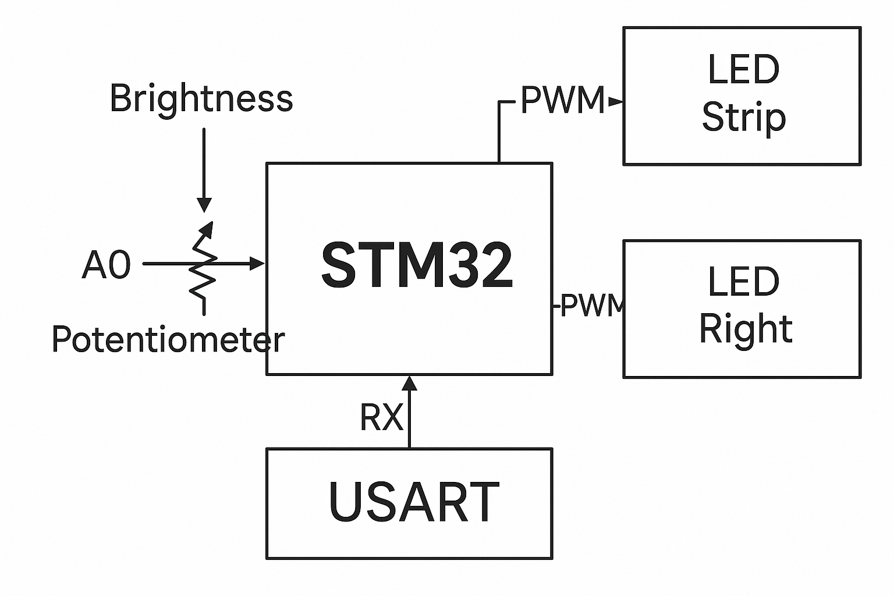

# STM32F429 LED Strip Controller

This project uses the STM32F429 Discovery board to control two separate LED strips using PWM signals. Each strip is driven by a MOSFET, and their brightness is controlled simultaneously using a single potentiometer connected to an ADC input.

## Overview

- **MCU**: STM32F429ZI (on Discovery board)
- **PWM Output**: Two channels (TIM5_CH3 and TIM3_CH1)
- **Control Input**: Potentiometer via ADC1 Channel 9
- **Clock**: External 8 MHz crystal
- **Target PWM Frequency**: 500 Hz
- **USART**: UART3 for debugging or data logging
- **DMA**: Used for USART RX

## Pin Assignments

| Arduino Pin | Color  | Signal     | APB Bus | MCU Pin |
|-------------|--------|------------|---------|---------|
| D5          | White  | TIM5_CH3   | APB1    | PA2     |
| D6          | Orange | TIM3_CH1   | APB1    | PA6     |
| A0          | -      | ADC1_IN9   | APB2    | PB1     |

## PWM Configuration

- **Timer Clock Source**: 90 MHz from APB1
- **Prescaler**: `PSC = 90 - 1`
- **Auto-reload Register**: `ARR = 2000 - 1` for 500 Hz PWM
- **Initial Phase**: 0
- **Duty Cycle**: Dynamically set based on ADC input (potentiometer)

## ADC Configuration

- **Channel**: ADC1 Channel 9 (PB1)
- **Resolution**: 12-bit
- **Sampling Time**: 480 cycles
- **Conversion Time**: Approx. 15 clock cycles

## USART3 Configuration

- **TX Pin**: PB10
- **RX Pin**: PB11
- **DMA RX**:
  - **DMA Stream**: 1
  - **Mode**: Normal
  - **Data Width**: Byte

## Functional Description

- Both LED strips will share the same brightness value.
- A potentiometer sets this value by feeding into ADC1_IN9.
- TIM5 and TIM3 are configured for PWM output to drive each LED strip.
- UART3 with DMA can be used to receive configuration or debug data.

## Notes

- PWM output pins are connected to MOSFET gates for LED strip control.

## Future Work

- Add UART command parsing for manual override of brightness
- Implement touch screen control for brightness adjustment
- Add FreeRTOS task structure
- Add REST API for easier control of the LED strips using ESP32

## Schematic

---
