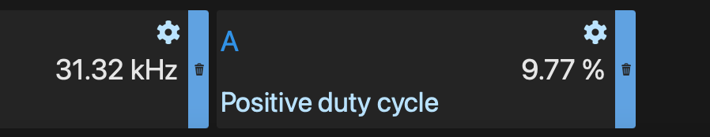

# Small STM32 Projects

## PWM Frequency

- System Clock is 72MHz
- 8-bit resolution (0-255) or 256 numbers


I like to think you can ++ once per clock cycle. In this case 72 million times a second. 
Each PWM cycle lasts for 256 counts.
How many cycles can we do per second?

```math
\text{frequency} = \frac{72,000,000\text{ counts}}{1 \text{ second}} * \frac{1\text{ cycle}}{256\text{ counts}}=\frac{218250\text{cycles}}{1\text{ second}}=218\text{kHz}
```

## Timer Notes
Setting up a timer that counts from 0 - 255 and incrementing once per clock cycle and restarting when it gets to the end.

### Timer Settings - Impacts all of its channels
- Clock Source - Internal Clock
- Prescaler - How many clock ticks to wait before incrementing our number
- Counter Mode - Up or Down (Up)
- Counter Period - Max number to count up to (255 here)
- Internal Clock Division - another way to slow things down (No Division)
- auto-reload preload - should just say when the counter hits max, it starts over (Enable)
- TRGO Trigger Output - Only used when using one timer to trigger another

### Channel Settings - Impacts a single pin
- Mode - (PWM Mode 1)
- Pulse - How many of the Couter Period counts to be "on" (25) 10% duty
- Output compare preload - (Enable)
- Fast Mode - (Disable)
- CH Polarity - flips graph (High)


## Programming

### Using ST-Link V2
Connect the ST-LINK/V2 programmer to the Blue Pill:

Pin 1 (VCC) on ST-LINK/V2 to 3V3 on Blue Pill

Pin 7 (SWDIO) on ST-LINK/V2 to SWDIO on Blue Pill

Pin 9 (SWCLK) on ST-LINK/V2 to SWCLK on Blue Pill

Pin 4 (GND) on ST-LINK/V2 to GND on Blue Pill


### Scope With Clock set to 8MHz
