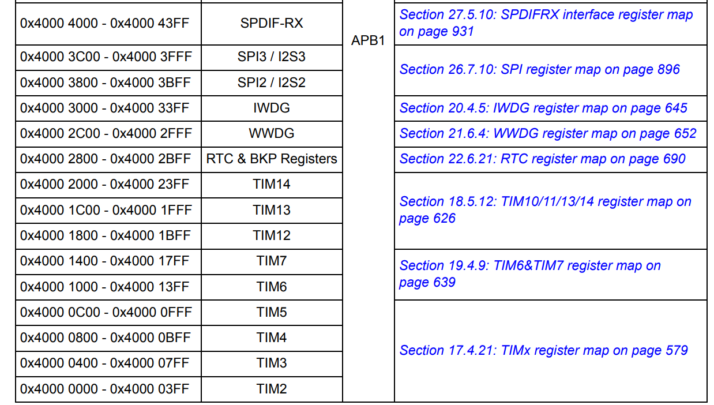
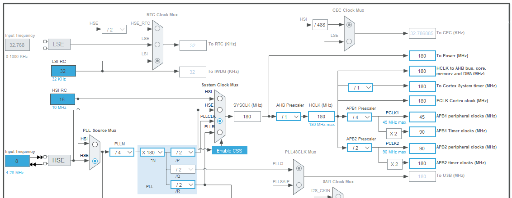
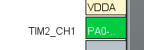
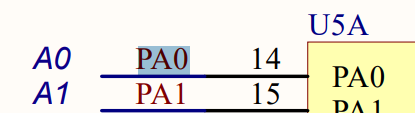
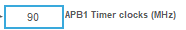
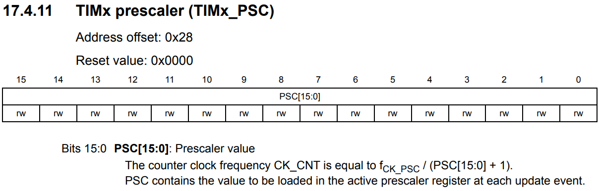
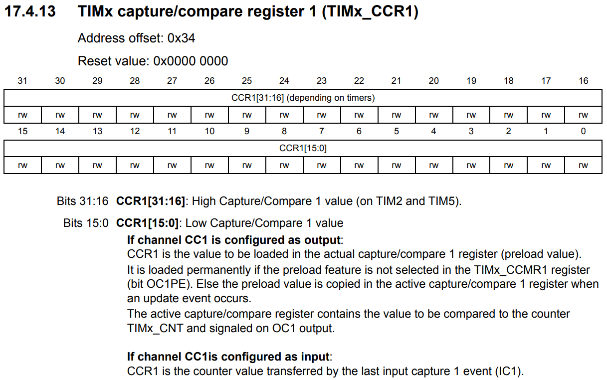
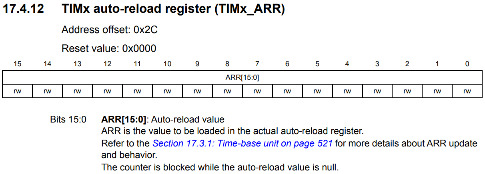
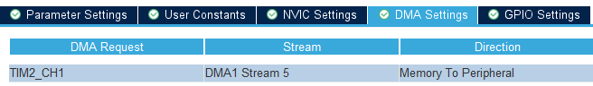
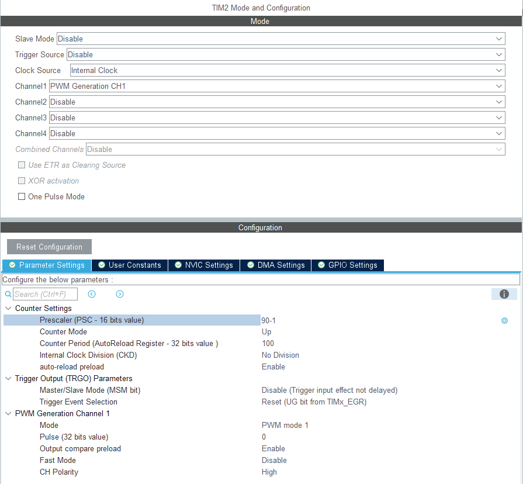

## RCC Settings

HSE -> Crystal Ceramic Resonator

## Clock Configuration

- STM32F446RE Nucleo uses 8.00 MHz crystal for MCU

1. Input 8 (MHz) for "Input Frequency"
2. Choose PCLK or PLLCLK
3. Type in 180 (MHz) or max frequency in HCLK

## SYS Mode and Configuration

Select Serial Wire for "Debug"

## PWM

### Respective Timer and Clock

Using the [Reference Manual](../Reference/STM32F446xx/rm0390-stm32f446xx-advanced-armbased-32bit-mcus-stmicroelectronics.pdf), TIM2 which will be used for generation is on APB1.  The APB1 Clock is set to 90 MHz.  Timers use timer clocks not peripheral clock





For each timer there are four channels.  Select channel one "PWM Generation CH1"
Select Source as internal clock

TIM2_CH1 is tied to PA0



A0 (marked) on the board is connected to PA0 of the IC.



### Timer Clock Calculation

- `APB_FREQUENCY` = 90 MHz
  


- `PRESCALER` = (90 - 1)
  
 

```math
CK\_CNT = \frac{APB\_FREQUENCY}{PRESCALER + 1} = \frac{90,000,000}{(90 - 1) + 1} = 1 \text{ MHz}
```

### Frequency Calculation

```math
FREQUENCY = \frac{CK\_CNT}{ARR} = \frac{1,000,000}{100} = 10 \text{ kHz}
```

### Duty Cycle Calculation

```math
DUTY\% = \left( \frac{CCR_x}{ARR} \right) \times 100
```

---

### Timer Registers

- **CCR (Capture/Compare Register)**: Used to capture the timer value or define the compare value for PWM output.
- `CCR_x` is the capture value (for the channel you're using)
  
 

---

- **ARR (Auto Reload Register)**: Sets the period of the timer. Determines the PWM period and resolution.
- `ARR` is the auto-reload register value
  
 

### Enable DMA

1. Enable for Channel 1
2. Set DMA to "Memory to Peripheral"



### Final Settings for PWM Generation


