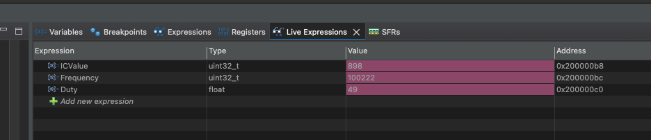

# STM32F446 PWM Setup & Measurement

This project is for configuring PWM on the STM32F446 Nucleo board. It includes setting up timers to generate PWM signals and to measure incoming signal frequency and duty cycle using the timer input capture features.

## Key Concepts

### Timer Registers

- **CCR (Capture/Compare Register)**: Used to capture the timer value or define the compare value for PWM output.
- **ARR (Auto Reload Register)**: Sets the period of the timer. Determines the PWM period and resolution.
    - Note: ARR adds +1 to the actual value, meaning a value of 999 results in 1000 counts.


## Timer Clock Calculation

```math
TIM\_CLOCK = \frac{APB\_FREQUENCY}{PRESCALER}
```


## Frequency Calculation

```math
FREQUENCY = \frac{TIM\_CLOCK}{ARR}
```

> Note: ARR adds 1 to the actual value.


## Duty Cycle Calculation

```math
DUTY\% = \left( \frac{CCR_x}{ARR} \right) \times 100
```

Where:
- `CCR_x` is the capture value (for the channel you're using)
- `ARR` is the auto-reload register value


## Summary

Ensure your timer is correctly mapped to an APB bus and the clock tree is set up appropriately in your STM32CubeMX or initialization code.

## Debugging Output when jumpered pins -  **D7 <=> A0**

