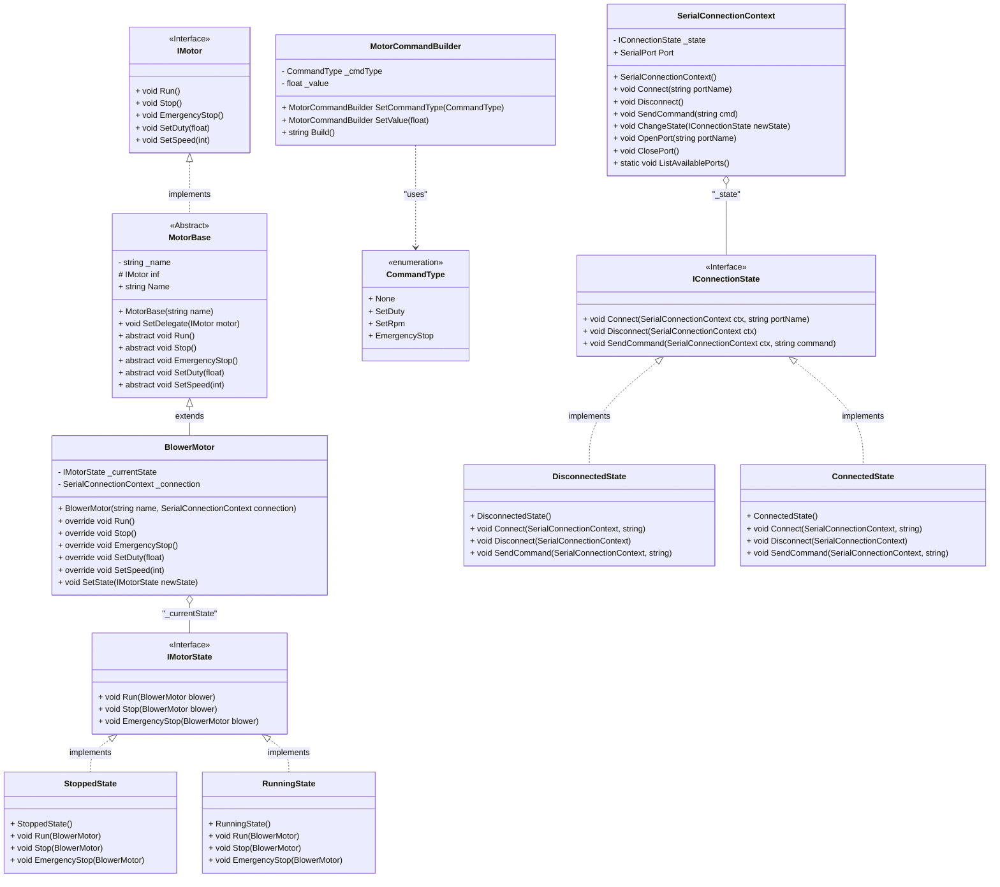

```mermaid
classDiagram

%% ---------- Motor side (Interface + Abstract + Concrete + States) ----------
class IMotor {
    <<Interface>>
    + void Run()
    + void Stop()
    + void EmergencyStop()
    + void SetDuty(float)
    + void SetSpeed(int)
}

class MotorBase {
    <<Abstract>>
    - string _name
    # IMotor inf
    + MotorBase(string name)
    + string Name
    + void SetDelegate(IMotor motor)
    + abstract void Run()
    + abstract void Stop()
    + abstract void EmergencyStop()
    + abstract void SetDuty(float)
    + abstract void SetSpeed(int)
}

class BlowerMotor {
    - IMotorState _currentState
    - SerialConnectionContext _connection
    + BlowerMotor(string name, SerialConnectionContext connection)
    + override void Run()
    + override void Stop()
    + override void EmergencyStop()
    + override void SetDuty(float)
    + override void SetSpeed(int)
    + void SetState(IMotorState newState)
}

class IMotorState {
    <<Interface>>
    + void Run(BlowerMotor blower)
    + void Stop(BlowerMotor blower)
    + void EmergencyStop(BlowerMotor blower)
}

class StoppedState {
    + StoppedState()
    + void Run(BlowerMotor)
    + void Stop(BlowerMotor)
    + void EmergencyStop(BlowerMotor)
}

class RunningState {
    + RunningState()
    + void Run(BlowerMotor)
    + void Stop(BlowerMotor)
    + void EmergencyStop(BlowerMotor)
}

IMotor <|.. MotorBase : implements
MotorBase <|-- BlowerMotor : extends
IMotorState <|.. StoppedState : implements
IMotorState <|.. RunningState : implements
BlowerMotor o-- IMotorState : "_currentState"


%% ---------- Builder ----------
class MotorCommandBuilder {
    - CommandType _cmdType
    - float _value
    + MotorCommandBuilder SetCommandType(CommandType)
    + MotorCommandBuilder SetValue(float)
    + string Build()
}

class CommandType {
    <<enumeration>>
    + None
    + SetDuty
    + SetRpm
    + EmergencyStop
}

MotorCommandBuilder ..> CommandType : "uses"


%% ---------- Connection side (SerialConnectionContext + states) ----------
class SerialConnectionContext {
    - IConnectionState _state
    + SerialPort Port
    + SerialConnectionContext()
    + void Connect(string portName)
    + void Disconnect()
    + void SendCommand(string cmd)
    + void ChangeState(IConnectionState newState)
    + void OpenPort(string portName)
    + void ClosePort()
    + static void ListAvailablePorts()
}

class IConnectionState {
    <<Interface>>
    + void Connect(SerialConnectionContext ctx, string portName)
    + void Disconnect(SerialConnectionContext ctx)
    + void SendCommand(SerialConnectionContext ctx, string command)
}

class DisconnectedState {
    + DisconnectedState()
    + void Connect(SerialConnectionContext, string)
    + void Disconnect(SerialConnectionContext)
    + void SendCommand(SerialConnectionContext, string)
}

class ConnectedState {
    + ConnectedState()
    + void Connect(SerialConnectionContext, string)
    + void Disconnect(SerialConnectionContext)
    + void SendCommand(SerialConnectionContext, string)
}

IConnectionState <|.. DisconnectedState : implements
IConnectionState <|.. ConnectedState : implements
SerialConnectionContext o-- IConnectionState : "_state"

```