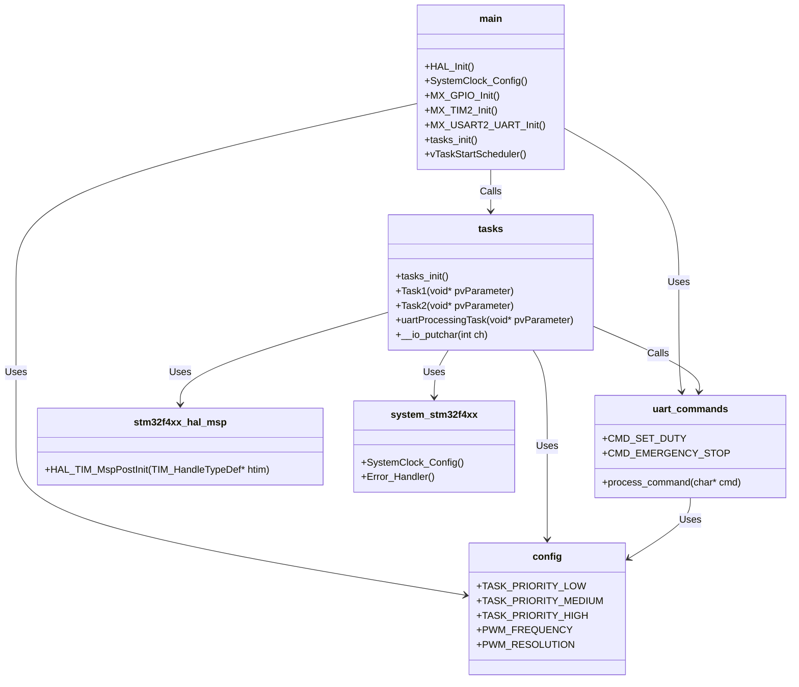

# Embedded System for Koford Motor Control

## Overview
This embedded system is designed for the STM32F446RE microcontroller to interface with the Koford S24V10A-4A motor controller. It provides PWM-based motor speed control via UART commands, with an emergency stop feature. Communication is established through ASCII command strings sent from a PC GUI application over UART.

## Hardware Setup
- **MCU:** STM32F446RE
- **Motor Driver:** Koford S24V10A-4A
- **Communication Interface:** UART (Baud Rate: 115200)
- **PWM Frequency:** 37 kHz (recommended by Koford datasheet)
- **Duty Cycle Range:** 0.0% - 100.0%
- **FreeRTOS:** Used for task management and real-time processing

## Files
- `main.c`: Main initialization and FreeRTOS scheduler startup.
- `freertos.c`: Initialization of FreeRTOS.
- `stm32f4xx_hal_msp.c`: MCU HAL initialization.
- `stm32f4xx_it.c`: Interrupt handlers.
- `syscalls.c`: System calls for printf redirection.
- `sysmem.c`: System memory allocation.
- `system_stm32f4xx.c`: System clock configuration.
- `tasks.c`: Task definitions for UART processing and motor control.
- `uart_commands.c`: Command parsing and handling logic.

## Configuration Files
- `config.h`: Defines system parameters including task priorities, stack sizes, UART configuration, and PWM settings.
- `main.h`: GPIO and peripheral definitions.
- `uart_commands.h`: Function prototypes and command definitions.

## Command Protocol
### 1. Set Duty Cycle
- **Command:** `DXX.X` (e.g., `D50.5` sets duty to 50.5%)
- **Response:** `Duty: XX.X%`
- **Behavior:** Adjusts the PWM duty cycle output to control motor speed.

### 2. Emergency Stop
- **Command:** `ESTOP`
- **Response:** `Emergency Stop!`
- **Behavior:** Immediately stops PWM output to halt motor operation.

## Task Descriptions (tasks.c)
- `Task1`: Example task for toggling LED (used for debugging).
- `Task2`: Example task for handling other non-UART functions.
- `uartProcessingTask`: Reads commands from the UART queue, processes valid commands (`DXX.X`, `ESTOP`), and sends acknowledgments.

## UART Processing
- Uses FreeRTOS queues (`uartRxQueue`) for non-blocking UART reception.
- UART interrupt (`HAL_UART_RxCpltCallback`) triggers data reception and sends data to `uartRxQueue`.
- The `uartProcessingTask` continuously reads commands and processes them accordingly.

## PWM Handling
- PWM is generated via `TIM2` configured at a frequency of 37 kHz.
- Duty cycle is modified by changing the `TIM2` compare value (`__HAL_TIM_SET_COMPARE()`).

## UML "Class" Diagram of Embedded Components
